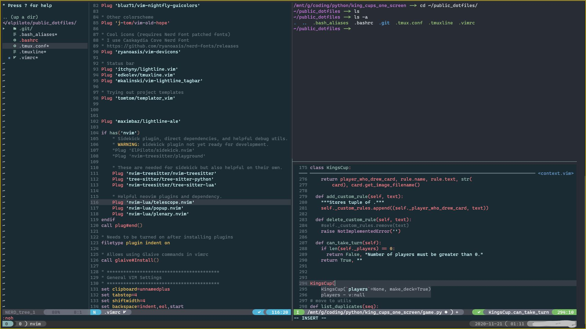

# public_dotfiles
I took what I could from my dotfiles and made it public. Work in progress.

## Notes:
- Use terminal that supports true colors (e.g. iTerm 2, Windows Terminal, gnome terminal)
- Use patched NERD Fonts (for ligatures and dev icons)
- neovim setup for python with:
  - linting (ALE/pylint)
  - auto-formatting(vim-codefmt/yapf)
  - LSP-based completion (vim-lsp/pyls)
  - semantic highlighting (nvim-treesitter/tree-sitter-python) [NOT ENABLED BY DEFAULT]

